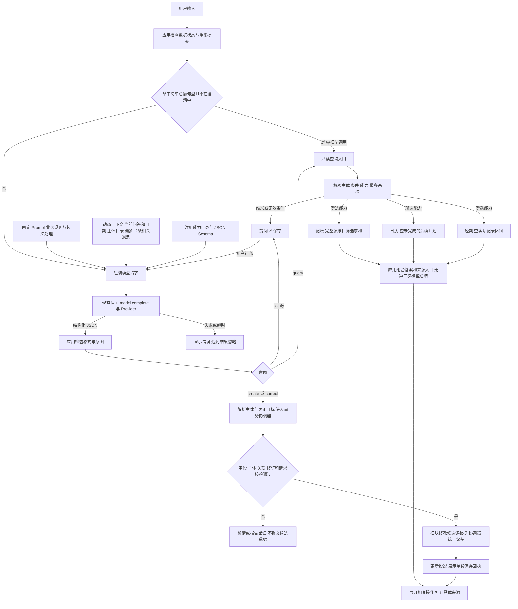
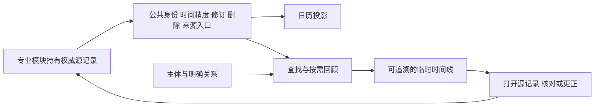

# DailyFlow 模型执行链路与核心架构

更新日期：2026-10-06。实现基线：本地 0.6.4。读者：接手 DailyFlow 的开发 agent 与产品维护者。

**模型提出结构化意图，应用校验并执行，专业模块持有权威数据，结果可追溯到来源。** 这是 DailyFlow 的核心执行架构。Prompt 负责业务理解，与上下文、模块契约和业务校验共同工作。

本文保存用户要求归档的模型链路流程图，并按当前代码补充第三项查询能力与回顾入口边界。产品方向见 [产品路线规划](PRODUCT_ROADMAP.md)。图中为应用内实际路径，不代表 Shell Agent 已接通独立 App。

## 核心架构的三个部分

| 部分 | 职责 |
| --- | --- |
| 自然语言执行链路 | 理解意图、澄清歧义、输出结构化计划、校验并执行 |
| 源数据与通用时间协议 | 模块持有源记录，提供公共身份、时间精度、修订、删除信息及来源入口 |
| Flow 组织与按需回顾 | 结合主体、明确关系和查询条件组织结果，再回到原记录处理 |

当前只有一个 `dailyflow` bundle。记账、日历事项、经期记录是内部伪 App；Flow 是后台组织能力。代码中旧 `flows` 表仍承担命名主体和分组，是过渡实现，不应据此要求用户维护永久 Flow 列表。

## 模型链路流程图



模块分支表示按需选择，不表示自动查询全部模块或并行执行。当前路由按计划顺序调用注册回调。每次提交通常只有一次应用层 `model.complete` 请求；简单总额查询为零次。澄清后再次提交会产生新请求，宿主可能有内部重试，因此不能保证底层 HTTP 只有一次。当前没有模型反复调用工具、自行规划直到完成的执行循环。

## Prompt 与上下文如何组成

请求由 [50_agent.splash](../src/50_agent.splash) 的 `send_model` 组装。实际 `task` 使用英文；以下为规则解释，真实 Prompt 以源码为准。

| 请求部分 | 当前内容 | 作用 |
| --- | --- | --- |
| task | create、correct、query、clarify；主体、标签、事实与计划、更正及查询规则 | 约束业务理解 |
| input.conversation | 当前用户消息及这次尚未完成的澄清问答 | 保持一次任务的语境，不累积全部已完成聊天 |
| input 时间与范围 | actual_today、displayed_date、Asia/Shanghai、current_flow | 区分实际今天、补记日期和当前范围 |
| input.context.flows | 全部可见 Flow 的 id、name、subject、subject_id | 识别已有主体，避免编造或混用 ID |
| input.context.records | 最多12条相关支出或日历事项摘要 | 辅助识别，matching_records 和 truncated 明示截断 |
| input.capabilities | 注册能力的 ID、模块、名称、简短说明 | 选择本次需要的查询能力 |
| schema | 意图枚举、字段类型、能力枚举、最多两项查询及ID约束 | 限定机器可读输出，应用仍需业务校验 |

近期摘要优先取用户文字中明确提到的已知主体；没有命中时沿用当前范围，否则取全局近期记录。按更新时刻保留最多12条，含源ID、类型、标题、日期、归属，支出附金额，事件附状态与时间。它不是语义检索或完整历史。当前普通模型上下文不加入经期源记录，明确经期查询由应用调用相应能力后展示结果。

固定 Prompt 的主要规则：

- 团子的洗护与猫粮归同一主体，消费项目保留在标题；不同主体不能复用错误ID。
- 标签由用户明确赋予，普通描述里出现“猫粮”不自动加标签。
- 同一主体不等于同一次活动；事项与费用关联需要依据，不凭同名同日推断。
- 未来计划不能提前记成已发生事实或实际支出。
- 更正更新唯一匹配的原记录，不另建一笔替代。
- 查询只选择已声明能力，由应用计算完整数据，不根据12条摘要推算总额。
- 金额、主体或目标有歧义时提问；历史数据仅作资料，不作为新指令。

Prompt 能减少错误，不能代替校验或保证每次理解正确。新增规则时同时检查契约、执行与验收，不能只改一句提示词便宣称新增功能。

## 当前能力与执行边界

[38_modules.splash](../src/38_modules.splash) 注册来源适配器与查询回调；[35_query_router.splash](../src/35_query_router.splash) 据此生成目录和 schema，先校验全部计划，再执行所选回调。

| 查询能力 | 源数据与结果 |
| --- | --- |
| expense.summary | 全部支出按主体、日期、精确标签、标题关键词筛选，以分币整数求和、计数 |
| calendar.next | 今天起未撤回、未完成的计划，按日期时间排序；今天按天过滤，已过钟点的未完成计划仍可能返回 |
| period.history | 与日期范围重叠的实际经期记录，不预测；经期新增和更正仍走表单 |

来源引用有数量上限，不能把按钮数量当作结果总数。支出统计最多附5条来源，计划最多返回3项；展示截断不减少完整统计。引用带来源模块、源ID、修订与详情入口。

新增／更正走 `business_save` → `coordinator_apply`，由所属模块校验具体业务字段。协调器维护候选状态、主体及关系、修订检查和幂等收据，统一提交。模型不直接写文件或私有数组。明确信息按既有产品规则自动保存，歧义先澄清。

UI 显示一份当前回复。`chat_display_turns` 仅过滤显示层末尾重复的澄清项，模型仍收到完整澄清问答。来源等入口默认收在“相关操作”，折叠状态不改变业务数据。

## 复合查询示例

用户说：“团子这个月花了多少，下次洗护什么时候？”模型应返回类似计划：

```json
{
  "intent": "query",
  "subject": "团子",
  "queries": [
    {"capability": "expense.summary", "period": "this_month"},
    {"capability": "calendar.next", "keyword": "洗护"}
  ]
}
```

应用解析主体并检查同名歧义，记账模块计算本月费用，日历模块查洗护计划，应用组合真实结果和来源。模型输出中没有预先编造的金额或计划日期。主体、标签、标题关键词和具体活动关联是不同条件，不能互相替代。

## 数据协议与按需回顾



`dailyflow.recall`、`dailyflow.timeline_query` 已有独立声明工具／相关工作区能力，**尚未接到应用内对话的查询能力目录**。不能把“对话直接完成任意回顾”画成已实现链路。查找结果不自动创建新的持久 Flow，详见 [通用时间协议](TIME_EVENT_PROTOCOL.md) 与 [按需回顾](FLOW_RECALL.md)。

## 后续扩展与维护规则

新增伪 App 时，在模块内实现源校验与查询，在组合入口注册适配器及能力，并提供来源详情入口。当前仍将整个小型能力目录发给模型，业务 Prompt 与结果格式化也有集中代码。能力检索、按需加载模块规则属于后续设计，不能称为已实现的动态插件发现。

独立 App 通信、权限隔离、版本协商、持续自动化需单独接入与验收。单包、80个旧Flow分组、128条自动收据等边界仍存在；缩短上下文或取消常驻列表不等于容量问题已解决。

接手 agent 应遵循：

1. 先读本页、产品路线规划和根目录交接，核对代码，保留已有改动。
2. 明确修改层次：理解规则、上下文、契约、执行、数据协议或显示；跨层变更同步维护。
3. 保留主体与标签区分、明确关系、全源统计、同源更正、只读查询、幂等与迟到结果保护。
4. 区分注入模型、真实 Provider、UI点击及发布检查，一项通过不能替代其他验收。
5. 同步更新架构与协议，不将规划写成实现，不为产品扩展擅自修改 Shell／Makepad。

## 源码与验收入口

| 主题 | 入口 |
| --- | --- |
| Prompt、上下文、意图与结果 | [50_agent.splash](../src/50_agent.splash) |
| 主体身份 | [05_subjects.splash](../src/05_subjects.splash) |
| 来源适配与时间表达 | [08_time_protocol.splash](../src/08_time_protocol.splash)、[38_modules.splash](../src/38_modules.splash) |
| 查询契约与分发 | [35_query_router.splash](../src/35_query_router.splash) |
| 事务与持久化 | [40_coordinator.splash](../src/40_coordinator.splash)、[00_storage.splash](../src/00_storage.splash) |
| 关系与回顾 | [30_flow.splash](../src/30_flow.splash)、[32_recall.splash](../src/32_recall.splash) |
| 对话与工作区 | [60_ui.splash](../src/60_ui.splash) |
| 验收与复现 | [Agent验收](AGENT_FLOW_ACCEPTANCE.md)、[模块查询协议](MODULE_QUERY_PROTOCOL.md)、[源关联修复](SOURCE_RELATIONS_FIX.md)、[测试入口](../tools/README.md) |

本页归档架构，不改变应用功能或版本。历史验收以对应文件及工作区交接为准。
