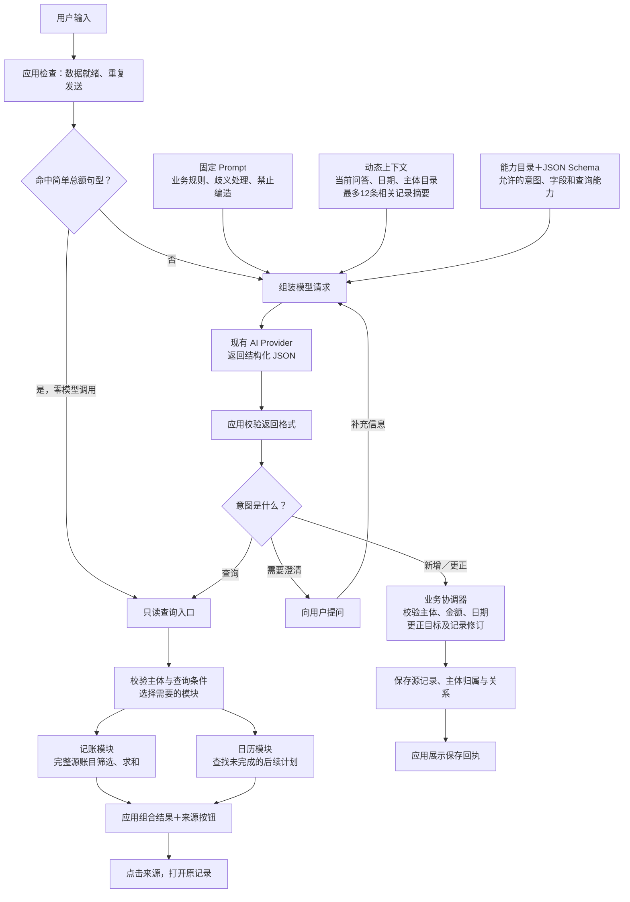

# Submit dailyflow 0.1.0

## DailyFlow：随手记下来，想起时再找

生活中的一件事，常常散落在几个地方：支出在账本里，安排在日历里，经过在笔记里。过一阵子想知道“这件事后来怎么样了”，又得自己翻找、拼起来。

**DailyFlow 想让每一次随手记录，都能成为以后找回一件事的线索。** 你照常说话、记账、安排生活，Flow 在背后连接有依据的记录；需要回看时，再围绕你的问题组织成一段可以核对、可以继续处理的过程。用户不必为每件小事建立项目，也不用维护越来越长的 Flow 列表。

当前 Demo 验证的是这条路径的基础：一句话记录事情与费用，专业模块分别保存，通过明确关系一起呈现；金额记错时改回同一笔源记录；查找时沿关联回看经过。记账、日历事项和经期记录分别检验金额、计划与发生时间、日期区间这几类不同的数据。

我们希望从这个起点，逐步走向一个**连接专业 App 的个人时间记录与行动系统**。专业 App 做好自己的业务，DailyFlow 帮用户把散落的事情重新看完整。

## 提交信息

- 发布者：毛茸茸战队
- 发布者 ID：`kumayuripool`
- 公开仓库：https://github.com/KumaYuriPool/DailyFlow
- 版本标签：`v0.1.0`（已推送）
- 完整提交 SHA：`dfb69ea9130fd5c0b2778ebf647ea900a7537713`
- 应用包路径：`bundle/`
- 拟用签名方式：**unsigned**（首次提交，未签）
- 平台／分类：Windows / productivity（效率工具）
- 隐私文档：https://github.com/KumaYuriPool/DailyFlow/blob/v0.1.0/PRIVACY.md （已核验可公开访问）

## 这个早期版本可以做什么

DailyFlow 帮助用户随手记录生活，需要时再找回。当前支持人民币支出、已发生的事情和明确的后续安排，并以手工记录经期日期区间作为第三个内部模块。用户可以通过普通／账本日历查看记录，也可以用关键词查找，由已保存的明确关联串起回顾时间线。原始记录始终是事实依据。目前所有模块运行在同一个脚本应用包中，尚未实现独立 App 之间的通信。

应用内对话通过宿主的 `model.complete` 服务理解支持范围内的记录、更正和查询请求。手工录入、日历和关键词查找也可独立于模型使用。对话尚不能直接发起完整的回顾时间线；当前没有后台提醒或云同步。容量限制和宿主依赖已在应用介绍及使用说明中披露。

## 核心架构与模型执行链路

核心原则是：**模型提出结构化意图，应用校验并执行，专业模块持有权威数据，结果可追溯到来源。**

| 核心部分 | 作用 |
| --- | --- |
| 自然语言执行 | 理解记录、更正、查询与澄清请求，由应用校验后交给对应模块执行 |
| 通用时间与来源协议 | 统一表达来源身份、发生／计划时间、时间精度与区间、修订和删除信息，以及原记录入口 |
| Flow 后台组织 | 保留主体与有依据的关联，需要时组织回顾；源数据归专业模块，查询结果不默认存成永久列表 |

通用协议是未来接入更多 App 的基础。它不只规定一个时间戳，还要让接入方说明“这是什么、来自哪里、什么时候发生、是否被改过、怎样回到原记录”。目前先由同一应用包内的三个模块验证；日历是协议的使用方之一，未来接入的 App 不必依附日历。完整技术说明见 `docs/AGENT_EXECUTION_ARCHITECTURE.md`。



查询基于完整源数据计算；发送给模型的最多 12 条近期摘要只用于理解上下文，不用于估算总额。选中的模块回调按查询计划顺序执行，由应用直接整理结果，不再调用第二次模型总结。普通提交通常发起一次应用级模型调用，支持的本地总额查询无需模型。用户补充澄清后会产生新提交，宿主内部也可能重试。当前尚无自主反复调用工具的 Agent 循环。

三个内部来源共用稳定标识、时间精度与区间、源修订号、删除标记和来源入口协议。Flow 在背后保存明确关联，查找时按需组织临时时间线，不复制源记录。`dailyflow.recall` 和 `dailyflow.timeline_query` 尚未接入对话能力目录，经期写入仍使用手工表单。上图描述的是应用内执行链路，跨 App 的 Shell Agent 执行尚未验收。

## 后续展望：从记录一笔，到理解一件事的来龙去脉

**以下是产品方向，尚未全部实现，也不是本次版本的功能承诺。** 我们希望逐步把“记录 → 找回 → 接着处理”连接起来，而每一步都能回到真实来源。

### 1. 问一件事，就能回看它的经过

下一步优先把现有查找能力接入对话。例如问“团子上次洗护是什么时候，花了多少，下次约了哪天？”，由 Agent 按需查询相关来源，组织已有事实、费用和明确安排，提供可打开的来源。用户纠正其中一笔后，再查应看到同一份更新结果。

现在已经有关键词查找和关联回顾，完整的对话回顾链路仍待接通。更长远的模糊表达与语义检索用于帮助找候选，不把猜测直接存成事实关系。

### 2. 让不同 App 的记录说同一种时间语言

旅行可以涉及行程、支出与日记；学习可以涉及课程、练习和复习安排；一件持续关注的事情可以有多次进展。我们希望这些专业 App 通过共同协议提供时间记录与来源入口，在用户授权范围内被查询和串联。

用户可以按一天浏览，也可以围绕一件事跨越多天、多个来源回看。专业 App 保留自己的界面和业务规则，Flow 负责组织它们之间有依据的联系。当前内部模块是在验证这种接入方式，独立 App 通信、权限与版本兼容仍是后续工作。

### 3. 让值得关注的事情继续跟得上

未来，用户可以主动选择持续关注某次旅行、一个学习目标或某件事的后续进展。系统保留关注条件，在获得授权并具备可靠调度能力后，再探索新进展汇总、计划跟进与提醒。

这类持续主题应由用户选择，普通搜索仍按需生成结果。自动采集、后台提醒、跨 App 动作回写都需要单独验证，当前版本没有这些能力。

### 4. 让记录积累得越多，使用仍然轻松

要承接长期生活记录，还需解决数据增长、主体身份、去重、备份恢复和敏感信息范围控制。目标是让用户可以选择哪些来源参与查询、哪些内容交给模型，并始终能够查看和更正原记录。

近期按“对话回顾闭环 → 容量与隐私控制、连续试用 → 接入规范与安装升级验收 → 独立 App 与持续流程”的顺序推进。当前定位为早期可运行 Demo；本次申请上架试用，是为了获得真实反馈，不代表这些阶段已经完成，也不承诺完成日期。

**希望最终带来的体验是：记录时不用忙着整理，回看时能找到来龙去脉，接着处理时知道该回到哪里。**

## 当前界面与演示

以下三张截图来自当前真实 card-host 界面，使用新建合成数据，不含个人账本。图片来自已推送的 `v0.1.0` 标签，已核验可公开读取且与本地候选截图一致。

### 普通日历

午餐 35 元与团子洗护 120 元，共 155 元；同日事项与明确关联的费用合并展示，计划不会预先计入支出。


### 支出账本

按费用源记录统计支出，同一笔费用不会因出现在多个视图中重复求和。


### 按需回顾

查找“团子洗护”，沿已确认的关系展示费用、事项和后续计划，可以回到原记录。当前演示为关键词查找，并非对话已经自动生成时间线。


## 本地检查结果

以下为 0.1.0 最终候选应用包重新 stamp 后的原始检查输出。新检查与八项扫描材料保存在 build/release-0.1.0/；仅改发布元数据，业务代码与原内部开发版一致。完整提交 SHA 对应该应用包。

```text
dailyflow 0.1.0 — PASSED
  [warning] publisher-signature: unsigned: accountability rests on the hub alone
  [warning] tools: dailyflow.save_record is destructive: every call waits for the host's approval
  [warning] tools: dailyflow.apply is destructive: every call waits for the host's approval
  grants: capabilities {"model", "storage"}, hosts {}, storage 16777216 bytes, agent workspace-write
```

## 发布者对扫描问题的答复

1. **功能声明：** `60_ui` 提供账本、日历、查找与帮助界面；`32_recall` 进行文字／主体匹配并遍历已保存的关联；`08_time_protocol` 和 `38_modules` 实现内部来源注册与协议；`50_agent` 路由支持的模型意图和模块查询。上述代码均包含在 `bundle/main.splash` 中。应用介绍已说明这一范围内的限制，截图使用真实当前界面和合成数据。
2. **平台与分类：** 本地已测试范围为 Windows 效率工具，未声明支持移动端或 macOS，尚未完成长期连续使用验证。
3. **权限与网络主机：** storage 用于保存记录、回执和备份；model 通过 `host.request("model.complete", ...)` 发送当前输入、澄清输入和有限的相关上下文。应用未声明直接访问的网络主机，凭据由宿主管理。`agent.tools` 为空，`storage.agent_workspace` 为 none。部分工具允许共享且返回私密数据，已披露其用途，使用范围应受用户对助手的授权约束。跨 App Shell 执行尚未验收。
4. **误导性界面：** 未提供索要密码、付款或登录的表单，也未仿冒系统授权界面。应用使用 DailyFlow 自身名称，界面区分保存中、错误、计划、已发生事项和来源详情；工具授权由宿主处理。
5. **agent_files 以外面向助手的指令：** 有。应用包的可执行源码包含 `50_agent` 有意发送给 `model.complete` 的任务提示词和结构约束。这些内容用于应用自身的意图解析，要求模型只使用支持的意图，并将历史记录视为数据；不是帮助文案，也不是通过记录内容注入的指令。`AGENT.md` 另行约束所声明的应用助手。请人工审核这两种用途，勿将源码中的模型提示词当成普通应用介绍。
6. **攻击性措辞：** 未发现辱骂或针对性攻击措辞，截图使用合成的午餐和宠物护理示例。
7. **Agent 与工具：** `AGENT.md` 将应用助手限制在已声明工具内，要求保留来源、处理歧义和修订号，未要求收集凭据或绕过授权。`dailyflow.save_record` 和 `dailyflow.apply` 支持删除，因此标记为 destructive，并由宿主确认。读取工具为只读，允许共享的结果标记为 `private_data: true`。没有工具使用应用自行确认的授权方式。本地回调测试不能证明所有商店宿主均支持这些应用实现的工具，该执行路径仍需验收。
8. **申请审核路径：** `human-review`（人工审核）。这是首次提交的未签名候选版本，目前验收范围限于本地 Windows。请核查目标宿主的模型兼容性、工具可用性和授权链路。生成自动扫描材料不代表已获维护者批准。

## 验收依据与已知缺口

仓库文档记录了已有的隔离业务、协议、界面和真实模型服务验收。本次提交准备在修正工具风险声明后，重新执行了 15 次真实 Splash 业务工具调用，并使用新建合成数据截取当前界面。本次准备未新增模型服务调用，也未进行商店安装验收。本地测试的桌面宿主包含模型权限修复，与审核者目标发行版的兼容性仍需核查。

部分本地报告保存在被 Git 忽略的构建目录中，无法通过公开仓库查看。如审核需要，可从已审候选版本中提供脱敏报告；本地路径本身不作为公开可访问的证据。不得上传个人状态、凭据或私人备份。

本地历史验收索引（原内部开发版 0.6.4，与本次 0.1.0 业务代码一致；这些路径不公开）：

| 报告，位于 `build/submission-review-0.6.4/` | 已核对内容 |
| --- | --- |
| `check.log` | 未签名候选包检查通过，保留签名和破坏性工具审批警告 |
| `review.json`、`scan.log` | 已生成八项扫描问题，尚非人工审核通过 |
| `business/report.json` | 15 次实际 Splash 调用：复合来源与关系、重复请求、同源更正、过期修订、失败回滚、删除保留其他来源、重启和迁移备份 |
| `screenshots/report.json` | 合成场景总额 155 元、三条关联回顾、导航不写业务数据，三张截图已查看 |
| `final-audit.json` | 个人状态、模型服务配置及原生文件保护哈希，测试进程清理与候选包文件哈希 |

当前仍有 128 条自动请求收据、80 个命名分组等容量边界，没有连续七天使用证据；跨 App Shell 执行、目标商店宿主安装及授权链路还需验收。本次准备修正了支持删除的 `dailyflow.apply`、`dailyflow.save_record` 工具风险声明为 `destructive` 并设置 `confirm: host`，未修改应用内对话自动保存逻辑。产品介绍、隐私文档和合成截图已更新；未新增路线图中的业务功能，也未修改 Shell/Rust、模型服务配置或个人数据。

首次公开版本从 0.1.0 起算，历史内部开发版 0.6.x 的功能与数据格式保留。本次固定了 Git 对应用包的换行转换，已验证标签中的完整应用包与本地受检字节一致，并通过确切提交导出包的检查。
