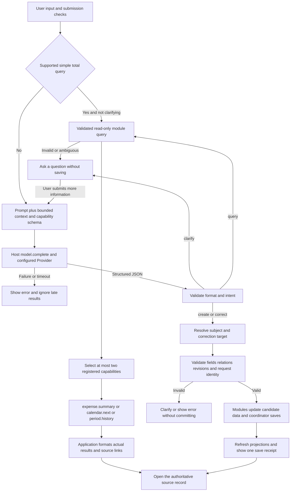

# DRAFT — Submit dailyflow 0.6.4

Not sent. Awaiting the publisher's review. Do not submit while the commit or public privacy URL is pending.

## Submission identity

- Publisher display name: 毛茸茸战队
- Proposed publisher ID: `kumayuripool` (not yet registered; publisher review pending)
- Repository: https://github.com/KumaYuriPool/DailyFlow
- Proposed tag: `v0.6.4` (not created)
- Full commit SHA: **PENDING — current working-tree bundle is not committed**
- Bundle path: `bundle/`
- Proposed signing status: unsigned first submission; no publisher key registered by this preparation
- Platform/category: Windows / productivity
- Privacy document: proposed https://github.com/KumaYuriPool/DailyFlow/blob/v0.6.4/PRIVACY.md — must resolve publicly before submission
- User-created demonstration video: optional attachment/link, pending publisher review; not supplied by this preparation

## What this early version does

DailyFlow records CNY expenses, occurred events and explicit plans, with manual period date ranges as a third internal module. It offers ordinary/ledger calendar views and keyword recall through persisted typed relations. Source records remain authoritative. This is one script bundle, not independent cross-App IPC.

In-app conversation uses the host's `model.complete` service for supported recording, correction and query intents. Model-independent manual screens, calendar and keyword recall remain available. Conversation does not yet initiate the full recall timeline. There is no background reminder or cloud sync. Capacity limits and host dependencies are disclosed in the listing and guide.

## Core architecture and model execution

The model proposes a structured intent; the application validates and executes it; specialized modules own authoritative records; results link back to those records. The architecture combines natural-language intent handling, a common time/source protocol, and Flow organization through explicit relations. Full documentation: `docs/AGENT_EXECUTION_ARCHITECTURE.md`; the local publisher review includes the expanded model flowchart in `docs/SUBMISSION_REVIEW_0.6.4.md`.



Queries use complete source data rather than estimating totals from the maximum 12 recent summaries sent as context. Selected module callbacks run in plan order; the answer is assembled without a second model summarization call. A normal submission uses one application-level model call, or zero for supported local totals. Clarification is a new submission; host retries may occur. This is not an autonomous repeated tool-call loop.

The three internal sources share stable identity, time precision/ranges, source revisions, deletion markers and source entries. Recall uses stored relations to create a transient timeline; it does not duplicate source data. `dailyflow.recall` and `dailyflow.timeline_query` are not wired into the conversation capability directory yet. Period writes remain manual. These diagrams describe the in-app path, not verified cross-App Shell Agent execution.

## Gate output

The local candidate output is below. After approval, rerun on the exact tagged bundle and replace this section if any bytes change. The full SHA must identify that exact bundle.

```text
dailyflow 0.6.4 — PASSED
  [warning] publisher-signature: unsigned: accountability rests on the hub alone
  [warning] tools: dailyflow.save_record is destructive: every call waits for the host's approval
  [warning] tools: dailyflow.apply is destructive: every call waits for the host's approval
  grants: capabilities {"model", "storage"}, hosts {}, storage 16777216 bytes, agent workspace-write
```

## Publisher answers to the scan questions

1. **Claims:** `60_ui` supplies ledger/calendar, recall and help screens; `32_recall` performs literal/subject matching plus persisted-relation traversal; `08_time_protocol` and `38_modules` implement registered internal sources; `50_agent` routes supported model intents and module queries. All are included in `bundle/main.splash`. Listing limitations match this scope. Screenshots show actual current UI with synthetic data.
2. **Platform/category:** Windows productivity is the tested local scope. No mobile or macOS claim. Long-term continuous use has not been validated.
3. **Grants/hosts:** storage saves the app's records, receipts and backups; model sends the current/clarification input and bounded related context through `host.request("model.complete", ...)`. No direct network hosts are declared. Credentials are owned by the host. `agent.tools` is empty and `storage.agent_workspace` is none. Tool declarations include private-data results and some shareable tools; these are disclosed and require the user's allowed-assistant scope. Cross-App Shell execution is not claimed as verified.
4. **Deception:** no password/payment/login sheet or imitation system approval UI. DailyFlow uses its own app name. UI state distinguishes saving, errors, planned/occurred items and source details; the host, not the app, handles tool approvals.
5. **Assistant-directed text outside agent_files:** Yes: bundled executable source contains the intentional in-app model task/schema sent by `50_agent` to `model.complete`. It is not user-facing help text or an instruction injected through record data. It directs this app's own parser to use supported intents and to treat historical data as data. `AGENT.md` separately addresses the declared app assistant. Human review should inspect this intentional distinction rather than treating the code prompt as ordinary listing copy.
6. **Abusive wording:** no abusive or targeted wording identified. Captures contain synthetic lunch/pet-care examples.
7. **Agent/tools:** `AGENT.md` limits the app assistant to declared application tools, preserving sources, ambiguity and revisions, with no credential collection or requested approval bypass. `dailyflow.save_record` and `dailyflow.apply` can delete and are therefore declared destructive with host confirmation. Read tools are read-only; shareable results are marked `private_data: true`. No tool uses app confirmation. Local callback tests are not evidence that every store host supports these app-implemented tools; that execution path remains a disclosed verification gap.
8. **Requested route:** human-review. First submission, unsigned candidate, limited Windows/local acceptance. Please verify target-host model compatibility, tool availability and approval routing. There is no claim that an automated scan packet equals maintainer acceptance.

## Evidence and known gaps

The repository documents existing isolated business, protocol, UI and real Provider checks. This preparation reran 15 real Splash business tool calls after the risk metadata correction, and captured current UI with fresh synthetic data. It did not run a new Provider call or a store installation. The locally tested desktop included a model-permission repair; compatibility with the reviewer's target release must be checked.

Some local reports live in ignored build directories and are not accessible through the repository. If needed, attach redacted reports from the reviewed candidate rather than implying the private local paths are public evidence. Do not upload personal state, credentials or private backups.
