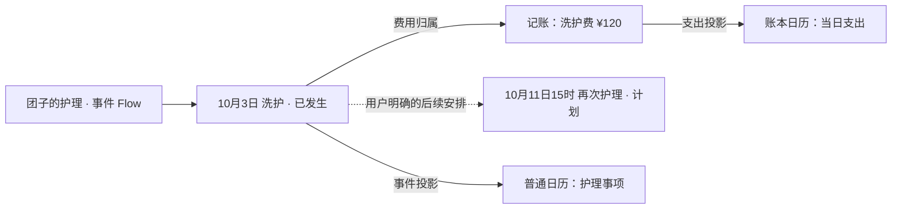
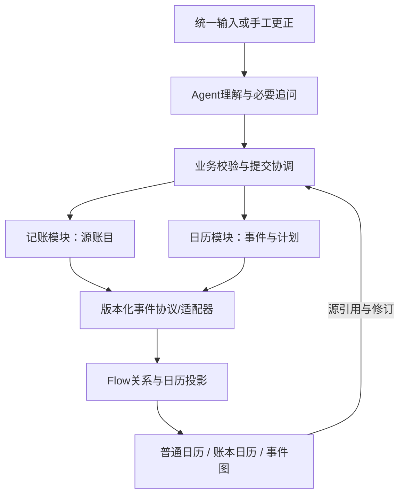

# DailyFlow 收敛计划：宠物护理事件 × 记账 × 双视图日历

2026-10-06 产品规划入口更新：[PRODUCT_ROADMAP](PRODUCT_ROADMAP.md) 提炼当前定位、概念、设计评估和后续阶段。本文继续保留收敛阶段实施历史，下方“唯一主入口”、旧版本与“尚未实施”均是当时语境，不覆盖后续经期接入、按需回顾及0.6.4状态。

2026-10-06 最新范围：用户明确继续建设通用时间协议，并加入“经期记录”作为第三个伪App。0.6.0实现见 [TIME_EVENT_PROTOCOL](TIME_EVENT_PROTOCOL.md)；下文删除经期入口的旧阶段限制被本次明确授权覆盖，历史数据仍保留。Flow后台组织、用户按需回顾为后续界面方向，不能把旧常驻列表当最终产品目标。

日期：2026-10-03 方案，2026-10-04 执行（Asia/Shanghai）。状态：**P1–P4 已完成本地 Windows 实现与验收**。实际证据与边界见 [EVENT_FLOW_ACCEPTANCE.md](EVENT_FLOW_ACCEPTANCE.md)。下文保留原规划语境，不再表示当前仅有0.3.0。

**2026-10-04 后续交互修订**：当前 0.4.0 交付后，用户要求对话作为首页，左侧分 App/Flow 两栏，右侧为可搜索的通用工作区；日历成为独立模块，普通/账本放入可搜索视图下拉，日格数字居中且选中日期用圆形。具体设计与现状边界见 [CONVERSATION_WORKSPACE_DESIGN.md](CONVERSATION_WORKSPACE_DESIGN.md)。本文件下方“日历默认首页”“两个主入口”等表述记录的是当时已执行的 P0–P4 方案，不覆盖此后确认的交互方向；新的交互尚未进入应用代码。

本文是当前产品范围和下一轮实施计划的唯一主入口。有冲突时，用户最新指令、工作区 `../agent.md`、项目 `AGENTS.md` 与本文优先；旧路线图、UI任务包和多模块开发交接仅作历史。当前可运行代码仍是0.3.0，不能把本计划写成已经完成。

## 1. 用户最新决定

用户指出当前交互混乱，Flow可视化不足，与自动Flow初衷有距离；本轮只验证宠物护理事件、记账和日历，其余需求删除，不留占位。日历必须可在普通日历与账本日历间切换，体现记账与日历通过Flow协议协作。

用户在本轮澄清中明确选择：**暂时一个 App，内部严格分开记账与日历模块，先验证交互和协议**。不拆成两个独立App，不新增宠物App。宠物护理是一个持续事件的Flow实例，用来检验通用事件关系与Agent组织能力；不能把界面、协议或解析器写死为宠物专用程序。

本轮只做计划和上下文同步，不开始实现、删除代码、迁移数据或启动新Agent。后续收到执行指令时，按本文推进。

## 2. 对现有实现的判断

| 用户问题 | 当前证据 | 本次改变 |
| --- | --- | --- |
| 交互混乱 | 六个同级导航；日历头部占位大；录入、查看、管理散落；详情直接进入表单 | 两个主入口、一个统一输入、一个上下文详情层；查看与编辑分离 |
| Flow不够直观 | `flows`主要是名称与成员ID，图按日期把账目竖排；连线没有持久关系类型 | 事件为主节点，费用为关联节点，明确显示已发生、用户计划、待补充及关系含义 |
| 自动化离初衷远 | 真实模型已会新建/复用分组，但提示仍要求用户带Flow名；更正已有记录主要靠手工 | Agent从主体、事项、上下文确定事件归属；自动关联、补充和明确更正，歧义再问 |
| 日历未体现双视图 | 日格仅显示日期；支出在下方摘要；没有普通/账本切换 | 同一月历切换展示规则，保留月份、选中日期和范围 |
| 协议没有落实 | `event_of()`主要用于导出；日历/Flow直接遍历共享`db.records`；未入Flow账目会被默认日历列表排除 | 记账模块产出协议事件，日历通过公开查询/投影消费；费用无需先加入Flow就能显示 |

0.3.0的真实模型、保存、幂等和重启结果仍有效，但这些不能证明新交互、事件图或模块协议已经完成。原方案确实记载过视角切换保留年月/日期，这一要求应恢复为必测项。

## 3. 本轮范围：明确删减

保留：普通月历、账本月历、支出账本、事件Flow、Agent文字输入、查看/更正、必要备份恢复与错误恢复。记账沿用人民币支出，暂不扩展收入、转账、多账户、报表或预算。

删除出当前产品：日记、经期、新闻、通用任务中心、提醒中心、预算功能、模块开关、AppCard/glance占位、宠物管理/档案App、无功能的原型入口，以及相关示例、Agent提示、工具能力和导航。不得用“即将推出”或灰色按钮保留它们。

事件内允许保存用户明确提出的后续计划和完成状态；这是事件时间语义，不保留独立任务产品，不承诺后台通知或主动生成护理安排。宠物是事件主体，可记录名称；不建立宠物品种、体重、档案等新功能。

“删除功能”不等于删除历史个人数据。迁移时先保留原状态完整备份；不支持的旧记录不进入新UI、模型上下文或新工具查询。历史实现/验收资料可归档保留，不能继续作为活跃需求。`apps/`旧占位bundle退出构建和运行入口，需保留的历史移出活跃应用目录；不清理真实账本或重置未提交修改。

## 4. 用户体验方案

### 4.1 两个主入口与统一输入

- **日历**：默认首页，顶部为月份导航、今天、`普通 | 账本`切换；“全部 / 当前事件”是独立范围筛选。
- **账本**：专业支出列表、金额和分类、查看/编辑；按日期或事件筛选，可直接定位到日历同一天。
- 全局保留一个“说一件事”输入区，可展开为对话面板。取消独立“对话”导航，不要求用户先跳页或选模块。
- Flow从日历事件或账目关联进入，打开事件工作区；设置缩为次级菜单中的数据管理，不占主导航。

桌面首页建议为“月历 + 当天详情”；打开事件时，事件工作区使用充足宽度，保留清楚的返回入口。窄屏按“月历→当天→事件”逐层进入，不同时堆所有区块。避免品牌大标题、常驻调试状态和手工管理抢占首屏。

查看态突出日期、事件、金额与关联；点击“修改”才进入编辑态。返回需恢复来源、视图模式、年月、选中日期、筛选和滚动位置。保存回执就地出现并能打开结果，不再额外跑一遍录入流程。

输入区明确显示语境，如“今天 · 全部事件”或“10月5日 · 团子的护理”。日期规则为：用户明确表达优先；“昨天”等相对日期以实际今天解析；否则使用已展示的补记日期，再默认今天。选中的日期不会暗中覆盖用户所说的日期。

### 4.2 普通日历与账本日历

| 行为 | 普通日历 | 账本日历 |
| --- | --- | --- |
| 日格重点 | 当天事项/计划的短标题、状态与数量 | 当天已发生支出合计，少量金额强弱提示 |
| 点选日期 | 当天事件；打开事件Flow | 当天账目；打开记账模块的源记录 |
| 护理事项附有费用 | 一个护理事件，详情能看到费用关联 | 一笔支出，标明所属护理事件 |
| 未来护理计划 | 展示“计划”，到期不自动变成已发生 | 不产生实际费用、不计入支出 |
| 没有关联Flow的普通消费 | 可显示来自记账的简要事项，不要求建Flow | 正常参与日期/月支出合计 |
| 空白日期 | 没有记录，不伪装已有事项 | “未记录”或空白，不宣称已核对为零消费 |

切换仅改变同一时间范围的展示，不能通过跳到另一个页面冒充视图切换。月份、选中日期与事件范围保持；汇总始终标明“本月全部支出”或“本月此事件支出”，两种范围不混算。

### 4.3 Flow展示真正的事件关系

先实现自动布局的事件图，不做用户拖线搭流程的编辑器。

- 顶部只呈现事件主题、当前进展、时间范围与已发生费用合计。
- 时间是布局依据；护理事实/明确计划为主节点，账目为附着的费用节点。费用节点显示金额、日期、来源为记账模块。
- 连线有明确语义：`费用归属`、`同一事项的计划/完成`、`用户明确的后续安排`。相邻日期不自动代表因果或依赖。
- 实线与“已发生”、虚线与“计划”共同表达状态，不只依赖颜色。待追问显示为草稿提示，未保存的内容不混入正式事件图。
- 节点点击可查看或更正对应源记录；更正后原位更新，不新增另一笔费用。可以纠正归属；移出Flow只解除关系，删除费用由记账模块处理。
- 没有证据时允许一笔消费暂不归组；Agent不为了让图更丰富而虚构后续护理、阶段、费用或完成状态。

示意是产品目标，尚不是实际UI：

“宠物护理”可展示为Flow主题；“团子洗护”是具体事件；¥120是记账模块源记录。三者各有稳定ID，不能用同一标签字符串替代所有概念。有多个宠物或多个匹配事件时询问归属；简单场景不强迫先建宠物档案。

## 5. Agent需要完成什么

本轮的自动Flow验证至少覆盖以下链路，而不仅是给消费加一个组名：

1. “今天给团子洗护花了120元。”→保存护理事实及一笔真实支出，自动新建或复用相符事件Flow；日历双视图各自呈现。
2. “给团子买护理用品花了35元。”→根据明确主体与事件上下文关联；不要求用户反复输入“归到某Flow”。不同事件存在竞争匹配时追问。
3. “10月11日15点再带团子去护理。”→保存明确计划，挂到同一事件；账本金额不增加。若上下文不能确定是否关联，先澄清。
4. “刚才洗护费不是120，是110。”→查询唯一候选、带当前修订修改同一源账目；账本、日历和图全部更新。多条可能账目时提供简短选择。
5. “洗护花了一百多。”→金额追问；不编造精确支出。来源事实与不完整费用如何显示要明确，首版可将本次复合写入整体保持待补充，避免半条成功。
6. “这次护理花了多少？”→按当前事件范围确定性计算并返回明细入口，不新建任何记录。真正合计由业务层完成。

单次允许有限的复合意图：一个事实、关联费用和一项明确后续计划。先验证这些操作，不建设任意多步自动执行平台。相同提交重试、超时、取消和旧回调继续沿用已验证的幂等与失效规则。

当前真实能力是应用内`model.complete`；新方案可继续用该通道理解意图，再调用受约束的模块操作。用户无需写Skill或手动搭图。Shell Agent跨App工具执行仍是未验收的独立路径，不能混称已打通。

## 6. 应用内协议与模块边界

### 6.1 责任划分

| 组件 | 拥有的权威数据/行为 | 消费什么 |
| --- | --- | --- |
| 记账模块 | 账目ID、修订、金额分、币种、发生日期、分类、用户标签；创建/更正/删除/查询 | Agent或用户明确的记账意图、事件关联请求 |
| 日历模块 | 事件/计划源记录、选中日期与视图；事件的时间和状态 | 记账模块通过协议发布的可重建展示投影 |
| Flow协调模块 | Flow ID、主题/主体引用、节点引用与有类型的关系 | 两个模块的事件摘要和源引用；不复制账目形成第二本账 |
| Agent协调入口 | 候选意图、追问、业务操作编排与结果说明 | 当前明确语境及经过范围限制的查询结果 |

两个业务模块通过公开接口协作，日历渲染不能继续直接遍历记账模块私有记录数组，Flow也不能直接改金额。实现可共用一个本地持久化容器，从而将源记录、关系、投影与收据原子提交；逻辑边界不要求本轮引入网络或跨进程传输。

### 6.2 第一阶段冻结的最小契约（以下为建议字段）

- 公共信封：`protocol_version`、`change_id`、`operation=upsert|delete`、`source_app`、`source_module`、`source_record_id`、`source_revision`、发生时间/精度/时区、展示摘要与`entry`操作入口。
- 实际`source_app`仍为`dailyflow`，`source_module`区分`expense`与`calendar`，如实表达单App；不能伪造两个独立App已经通信。
- 记账扩展：整数分`amount_minor`、`currency=CNY`、支出类型和模块分类。业务标签命名空间由记账模块定义，用户标签另存；公共协议不硬编码“宠物/医疗/餐饮”等词表。
- 日历扩展：`planned|occurred|cancelled`、事项时间、完成引用；计划到期本身不是完成证据。
- Flow关系：稳定Flow ID、节点源引用、`belongs_to`/`expense_for`/`fulfills`/`follow_up`等最小关系及其依据。哪些关系需要落库由契约阶段按场景确定，不提前做通用图数据库。
- 操作入口：目标模块、源ID、允许动作与修订；从图或日历修改仍路由到来源业务接口。

`expense.create/update/delete/query`、`calendar.event.*`、`flow.link/unlink/query`是逻辑接口草案，不宣称现有宿主已提供同名API。先定义应用内函数/结构契约，再适配现有`tools.json`。实现语言的模块加载能力需小样例确认；即使最终打包为一个Splash文件，也必须保留可测试的模块契约，不能回到互相访问私有状态。

### 6.3 一致性验收，不只导出一份JSON

- 新建账目必须产生协议变更，日历据此显示；更正日期会把投影移到新日期，并同时更新两天及当月合计。
- 同一源ID/修订重复投递不增加节点或金额；更旧修订不能覆盖新值。删除有明确撤回/墓碑语义，重复删除无副作用。
- 一条账目可关联多个Flow，但每日/月全局汇总只按源ID计一次；Flow汇总只统计自己明确关联的已发生账目。
- 日历投影可以从来源公开快照重建；不能只在Agent聊天成功时刷新。手工记账、更正、删除都必须经过同一协议路径。
- 联合写入在同一候选状态校验后一次提交；失败不能残留孤立Flow或虚假成功。模型不承担金额计算或直接写状态文件。
- 测试用协议夹具即可驱动日历投影，无需加载记账UI；这才是内部边界成立的证据。该证据不等于跨App传输验收。

## 7. 实施顺序与可委派任务

| 阶段/任务 | 难度 | 交付与通过条件 | 依赖 |
| --- | --- | --- | --- |
| P0 体验与协议定稿 | 中高 | 普通/账本/事件图三种可点击状态原型；一条黄金场景；模块契约、图关系与状态迁移表。先验证交互再接模型 | 本文 |
| P1 收敛与迁移设计 | 高 | 删除非目标入口/提示/工具；保留历史备份；记账/日历/Flow边界；旧支出ID与有效关联保留；不支持旧记录不会泄露到新UI或AI | P0 |
| P2-A 记账与协议适配 | 高 | 权威账目操作、变更协议、幂等与修订、复合提交；协议契约测试 | P0/P1接口冻结 |
| P2-B 双视图日历与路由 | 中高 | 日格事件/金额切换、月份日期范围保留、当天详情、源记录返回；仅通过公开接口消费数据 | P0/P1接口冻结 |
| P2-C 事件图与Agent编排 | 高 | 有语义的关系图；自动归属、新增/计划/更正/查询/追问；事实与计划分离，金额不靠模型计算 | P0/P1接口冻结 |
| P3 集成与真实验收 | 高 | 同一真实场景贯穿Agent、账本、两种日历、图、修改/删除/重启与故障；逐层保留证据 | P2三路 |
| P4 清理交付 | 低中 | 删掉遗留占位和死入口；更新启动、帮助、截图和新Agent交接；核对保护文件 | P3 |

P0/P1由主Agent先集中完成，契约未定不并行修改共享入口。P2可分给三个Agent，各自在独立源码副本/明确所属文件工作，主Agent单独合入；不同时改当前单文件`main.splash`。复用现有真实模型和持久化测试，但过期六导航按钮测试需更新，不能沿用旧通过标记。

本轮不创建新Agent、不承诺工期；上述是下一轮可委派任务，不代表已开工。

## 8. 验收门槛

1. 新用户不创建标签、Flow或宠物档案，也能输入明确护理事项并得到事件图、账目和日历结果。
2. 图上能一眼区别护理事实、费用与后续计划；明确看出费用归属，不能只把账目列表换成带线卡片。
3. 普通/账本切换保留年月、日期、事件范围；未关联Flow的支出不消失；计划不增加支出。
4. 从账本、日历、图任一入口更正120→110，其他展示一致；改日期后旧日扣减、新日增加；不会出现第二笔账。
5. 删除Flow保留源账；删除账目撤下费用投影且不误删护理事实；多Flow不重复汇总。
6. 真实模型完成无Flow名输入、后续自动关联、含糊追问、唯一账目更正与事件合计查询。多候选归属或修改必须追问，不能仅凭关键词强制匹配。
7. 协议重复/乱序、存储失败、取消/超时/迟到回调、重启、投影重建均有断言；不把注入回复测试称为真实Provider测试。
8. 桌面与窄屏实际点击和截图验证：无水平溢出、主操作可见、读取态与编辑态分离、返回上下文正确。对比旧版标出删掉的交互步骤。
9. 产品中没有经期/新闻/日记/预算/通用任务/提醒等入口、占位、工具或模型输出分支。旧数据备份仍完整可取。

完成定义：上述交互、协议和真实场景全部通过。仅gate、截图、模型生成JSON或0.3.0已有样例通过，都不能宣称此次重构完成。

## 9. 新Agent接手必读

- 工作区：`D:\Life\AgenticApp`；项目：`D:\Life\AgenticApp\DailyFlow`。沟通使用中文。
- 阅读顺序：根`agent.md`最新节 → 项目`AGENTS.md`最新节 → 本文 → `AGENT_FLOW_ACCEPTANCE.md`理解0.3.0实际基线 → `DATA_PROTOCOL.md`理解旧存储。
- 当前源码：`bundle/main.splash`、`bundle/tools.json`、`bundle/AGENT.md`。当前`apps/`旧目录不是新架构。无需从占位原型重新开发。
- 本轮只读核对时HEAD为`2d6d308`（`feat:跑通agent`），manifest为0.3.0；本轮改动仅为规划文档，未执行提交。接手需重新查看Git状态，不把历史交付时的“未提交”状态当成当前状态。
- AI入口：`run-dailyflow-ai.cmd`，使用已有完整桌面/Provider；数据`.local-state/desktop/apps/dailyflow/`。旧手工入口`run-dailyflow.cmd`不提供模型，数据`.local-state/dailyflow/`。两者不自动迁移。
- 0.3.0已经真实验证：45元+追问26元→同Flow合计71；32次工具调用；注入模型12+1重启断言；窄屏更正/返回/删除/重启。证据在`build/agent-flow-r1/`。新目标仍未实现。
- 只改Splash应用与必要开发/测试文件；不改Shell/Rust/Hub/Makepad，不新增原生业务后台服务。保留既有桥接改动、两个Cargo.lock、Windows`d3d11.rs`修复和个人账本。
- 所有运行测试使用新的隔离数据目录；不要用真实账目验收，不打印/复制Provider密钥。提交、推送、发布未获授权。
- 已知技术债：自动收据128条上限、聊天草稿不跨重启、旧备份恢复会回退收据、无后台唤醒。迁移不能清空收据来假装解决幂等或容量；不要把扩容和后台平台工程混入本次UI验证。
- 用户说开始后先检查未提交变化与保护文件，备份当前0.3.0，再按P0推进。遇到技术限制给出具体证据和应用层替代方案，不能擅自扩大到Shell开发。

可复制的新Agent任务提示：

> 请先读 D:\Life\AgenticApp\agent.md、DailyFlow\AGENTS.md 和 DailyFlow\docs\PET_CARE_FLOW_REPLAN.md。本轮暂不拆App，只保留记账、普通/账本双视图日历和事件Flow；宠物护理只是验证事件。先落实新交互和模块协议，再完成Agent自动组织、关联、更正、查询及真实验收；删除其余产品入口和占位，保留历史个人数据。按文档阶段执行，不修改Shell/Rust，不重置现有修改，不提交发布。不能用已有0.3.0的账目分组时间线冒充新的事件Flow。
