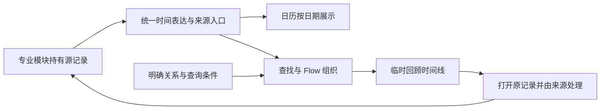

# DailyFlow 产品定位、设计评估与路线规划

> 2026-10-06：发布编号说明：首次公开版按用户决定使用 0.1.0，业务基线仍为下文内部开发版 0.6.4。重新编号不代表回退功能或修改数据格式，历史验收编号保留。

更新：2026-10-06。当前实现基线为本地 0.6.4；本版只补充产品说明，不代表新增业务能力。本文是当前产品方向与后续优先级入口，结合用户最新决定提炼旧 PRODUCT_VISION_ROADMAP，不沿用旧功能清单。阶段安排是建议，不是发布日期或已完成声明，也不授权现在拆 App、修改 Shell/Rust、发布或恢复已删除产品入口。

## 1. 产品定位与价值

**DailyFlow 是帮助个人记录、找回并继续处理生活中事情的时间记录与回顾工具。** 以对话降低输入负担，以统一时间协议连接专业模块，以 Flow 在后台组织明确关系；用户可以按一天浏览，也可以围绕一件事回看跨天的发展。

希望用户得到三个直接价值：

- **容易记录**：不用先建项目、取 Flow 名或整理分类；明确事实能保存，有歧义再问，记错能改。
- **容易找回**：日历按天看，查找围绕事情看；同一批源记录可形成不同回顾，附来源与关联依据。
- **容易接着处理**：从回顾回到具体记录，核对、更正、补充计划。后续才考虑经过授权的持续跟踪与提醒。

一个典型场景：记录某次 SPA 及350元费用，再记录明确约好的下一次安排。费用由记账管理，事项/计划由自己的来源管理；查询时组成有依据的过程。更正费用后仍是同一笔，重复展示不重复求和，计划不预先当作已发生事实。宠物护理也是同类场景，不是产品定位本身。

现在用一个 App 的记账、日历事项和经期模块验证这条路径。长期希望有时间记录的专业 App 都能通过协议接入；不要求每个 App 变成日历，也不要求用户掌握模块或协议术语。

## 2. 从旧愿景保留什么、更新什么

| 旧文档的要点 | 当前取舍 |
| --- | --- |
| 记录、找回、行动三个价值 | 保留；当前行动主要是源记录查看、更正和计划处理，自动执行后置 |
| 专业源数据＋统一事件、时间、关系、入口 | 保留为核心，通用协议优先于再扩一批功能 |
| 日历为主要入口 | 更新为对话输入＋日历/查找等按需工作区；日历是时间信息的使用方 |
| 可管理的 Flow 列表 | 更新为后台组织、按需生成回顾；永久专题只能是将来用户主动选择的能力 |
| 标签直接生成 Flow、按主题分组 | 区分主体、标签、具体关系和查询条件；不默认让每个标签/搜索产生永久列表 |
| 时间线与 Workflow 有区别 | 保留；排出时间线不等于自动采集、定时运行、提醒和动作回写均已完成 |
| 新闻、预算、任务中心、卡片、后台、多平台 | 作为远期探索，不回到当前待办，不新增占位入口 |
| 经期作为时间区间样本 | 根据用户后续明确要求保留第三内部模块；仅实际记录，不做预测 |
| 按能力门槛推进、试用后发布 | 保留；旧 M0–M7 的完成标签不能直接套用新范围 |

## 3. 核心概念与责任

| 概念 | 产品含义 | 必须守住的边界 |
| --- | --- | --- |
| 源记录 | 各模块持有的原始业务事实 | 金额、经期起止等由所属模块校验；只修改权威来源 |
| 事件 Event | 源记录提供的公共时间表达 | 稳定身份、时间、摘要、来源修订和入口；不是复制一套完整账本 |
| 时间 Time | 发生/计划时间、日期精度、区间、收录与更新时间 | 不把补记时间当发生时间；未知时刻不伪造；未来计划不算完成 |
| 主体 Subject | 人、宠物、对象或项目的身份 | 同名不必同一主体；同主体不等于同一次活动 |
| 标签 Tag | 用户明确赋予的属性 | 不替代身份、因果或费用关联；不因普通描述自动建立标签 |
| 关联 Relation | 事项、费用、后续安排等之间有依据的连接 | 保留来源/依据，允许纠正；不靠同日同名猜出事实 |
| Flow | 基于公共时间记录和明确关系组织事情的能力 | 不要求用户维护不断增长的列表；不接管专业业务数据 |
| 回顾时间线 | 对一次查找生成的可追溯结果 | 可重新计算，不默认持久化为新 Flow，不改变原记录 |
| 入口 Entry | 指向拥有数据的模块及具体记录/动作 | 打开具体来源；目标缺失或无权限时解释失败，不能假装成功 |
| 计划与规则 | 用户的未来安排，以及后续可能的自动执行条件 | 计划不等于提醒；规则、调度与后台可靠性单独验收 |

产品里说的 Flow 是后台组织能力；代码中旧 `flows` 表目前仍承担命名主体/分组，这是过渡实现，不能用数据表名称反过来限定产品。

## 4. Flow 的基础是通用时间协议

协议不只是统一一个 timestamp。要让一个来源被可靠组织，至少要知道：**它是谁、来自哪、何时发生或计划发生、时间精度是什么、有没有更正或删除，以及如何回到原记录。** 在此基础上才谈关系、搜索与时间线。

持久保留源记录、明确关系、主体身份及必要修订/删除信息；查找结果、展示顺序和摘要按需重建。若将来允许收藏专题，保存用户选择的查询条件和偏好，而不是再次复制源记录。收藏、自动规则和完整修订历史目前均不能当成已有能力。

内部伪 App 和将来的独立 App 应遵守相同语义。当前 v2 已提供稳定公共身份、来源修订、日期/分钟精度、开放区间、发生/计划时间区分、删除标记及来源动作，并用三个注册适配器消费。它仍受同包和 Asia/Shanghai 限制，提供当前快照而非完整事件日志。外部 App 的权限、接收、版本协商和通信尚未实现；有字段不等于链路已经接通。字段与已验收范围见 [TIME_EVENT_PROTOCOL](TIME_EVENT_PROTOCOL.md)。

## 5. 当前做到哪一步

判断基于当前源码与已有隔离验收，不按文件数量或版本号估算百分比。

| 层面 | 当前状态 | 还缺什么 |
| --- | --- | --- |
| 定位与交互方向 | 对话输入、按需工作区、App/视图搜索、常驻 Flow 栏移除 | 长期实际使用是否省事；范围语境是否仍让用户困惑 |
| 模块与时间协议 | 三个内部来源注册，公共投影、区间、修订/删除、分页已实现；有契约及第四临时适配器验证 | 外部接入、兼容策略、多时区、独立权限；不能称开放生态 |
| 写入与更正 | 明确记录保存、歧义追问、同源费用更正、复合源关联、备份恢复有本地证据 | 更广的自然语言/长期数据验证；经期写入仍用表单 |
| 日历与账本 | 双视图、补记日期分离、同日事项与关联费用合并，源费用计一次 | 日历模块仍同时拥有事项源和展示职责，尚未完全分离 |
| 按需回顾 | 名字/关键词及确认关系生成时间线，来源可打开，更正后再查询更新 | 对话未接 recall；模糊表达、同义词、复杂问题尚不支持 |
| Agent 查询 | 全源支出统计、近期计划、经期历史，最多两项能力组合，有真实 Provider 样本 | 不能当任意生活问答或全文记忆；跨 App Shell Agent 未验收 |
| 日常可靠性 | 本地持久化、失败/重试、备份及宽窄屏有测试 | 连续个人试用、增长容量、性能、恢复可用性；128收据/80分组等边界 |
| 产品表达与发布 | 0.6.4补产品定位、价值、核心概念和协议作用 | 上架资料仍占位/过期；隐私控制、目标发行版安装与使用仍需验证 |

**总体阶段：已越过静态原型，形成可以运行的单 App 核心闭环验证版，正在走向可持续日用的 MVP。** 尚不能称成熟个人时间系统、持续自动化 Workflow 或多 App 平台。旧文档“卡片、提醒、预算通过”等历史状态不代表本次收敛后产品仍提供它们。

已有证据入口：[源关联修复](SOURCE_RELATIONS_FIX.md)、[按需回顾](FLOW_RECALL.md)、[时间协议](TIME_EVENT_PROTOCOL.md)、[查询协议](MODULE_QUERY_PROTOCOL.md)。这些结论沿用对应版本验收；本次仅对帮助内容进行新 UI 验证，不冒充重新跑过全部业务场景。

## 6. 有没有跑偏

**没有整体跑偏；对话优先与按需回顾是更接近用户目标的修正。** 记账验证金额和复合关系，经期验证日期区间，二者都服务于通用时间协议。前提是继续把它们当专业来源，而不是不断堆叠生活工具。

需要主动收敛的四处偏差：

1. **说明偏操作，核心价值表达不足。** 原“Flow在背后做什么”大半在讲范围按钮。本版补充定位、概念和协议作用，帮助用户理解为什么这些记录能连起来。
2. **交互已简化，存储概念仍沿用旧分组。** 主体 ID 可由 Flow 派生，源仍持有 flow_ids，命名主体仍创建永久组且上限80。删除侧栏没有消除底层增长问题；后续需在兼容历史数据前提下分清主体、关系和可选收藏查询。
3. **对话与查找尚未形成同一条体验。** 用户期待“问一件事就组织回顾”，当前还要进入查找页输入关键词。这是近期最直接的体验缺口，优先于新增 App。
4. **协议存在，但尚未完全脱离具体承载。** 当前来源 App 固定 dailyflow，事项源归 calendar，新增模块的持久化校验和 UI 仍须显式接入。应称内部通用协议验证，不称任意 App 即插即用。

此外，不应把继续打磨按钮或反复更新版本号当成成熟度增长。应以“记录是否可信、查找是否找得到、纠错是否影响所有视图、连续使用是否省事”判断投入价值。

## 7. 建议的新阶段

优先完成当前三个来源的纵向闭环，不预设新 App 数量或发布日期。下列门槛为建议的验收标准，尚未完成的项不能写成现有功能。

| 阶段 | 主要工作 | 退出门槛 |
| --- | --- | --- |
| R0 定位与概念统一（本次） | 提炼旧愿景，补内置说明，建立当前路线图；标明历史文档 | 用户能区分源记录、事件、关联、Flow与时间线；界面说明与当前能力一致 |
| R1 记录→问事→回顾→更正闭环（下一优先） | 把只读 recall 接入能力目录与对话路由；按需打开时间线；保留来源/依据；歧义再问 | 真实模型输入检索问题，确实调用查询并展示结果；无结果不编造、同名不乱合、未来计划不算事实；更正后重查一致；查询不写永久列表 |
| R2 从验证版到可持续日用 | 处理收据/分组容量、主体与旧Flow耦合，明确范围语境；备份更易找到；敏感记录范围与模型数据使用可控制 | 兼容已有个人数据并有迁移回退；超过原上限的隔离数据测试、重启恢复及性能证据；至少连续7天实际试用并记录问题 |
| R3 接入规范与发布准备 | 在R1/R2稳定后写清版本兼容和适配器要求；新临时来源无需修改日历/Flow核心；完善商店资料并验证目标宿主 | 公开字段与失败语义可独立验证；商店材料真实；安装、升级、数据保留及来源跳转实测。满足这些再决定正式提交 |
| R4 独立 App 与持续流程探索 | 若用户明确决定拆分且宿主已有能力可用，再验证独立来源；之后按需求探索持续主题、规则或通知 | 从独立 App 记录到回顾、来源跳转、更正/删除、权限撤销均实测；提醒必须独立验证关闭/休眠/重启条件 |

R1先接现有准确查询，不急着上任意语义推断；语义召回即使未来加入，也只能找候选，不能自动把猜测固化成事实关系。R2的容量问题不能简单靠加大数字解决，需要检验增长、去重保证、兼容和恢复。R3可能发现宿主差距，允许记录依赖并继续应用层工作，不绕过当前禁止修改原生层的约束。

## 8. 如何判断产品在变好

- **记录可信**：选定验收场景中无意外重复保存，金额由程序计算，失败不显示已保存；记录实际误关联、更正失败样本。
- **找回省事**：能从一个问题到达相关过程并打开原记录；分别记录找回成功率、操作次数和模型耗时，不把模糊问题猜对一次当完成。
- **解释清楚**：结果能说明来源、为什么相关、哪些是计划、哪里没有足够信息。
- **增长可承受**：数据增加后，不要求用户维护同比增长的侧栏列表；容量与延迟有实测，不靠删除个人历史维持运行。
- **边界可理解**：未提供的后台、外部 App、预测和同步能力不出现在默认承诺中；敏感来源只进入相关且允许的处理。

先做隔离样本基线，再开始用户实际连续试用；建议7天，尚未发生。除选定场景不重复/不误写这类正确性门槛外，不凭空给成功率或速度目标。记录真实问题后再定改进指标。

## 9. 文档分工

- 本文：当前产品方向、成熟度判断、优先级和建议验收门槛。
- [USER_GUIDE](USER_GUIDE.md)：面向日常用户，与 `src/user_guide.json` 构建内容同步，未来功能必须显式标为目标。
- [PRODUCT_VISION_ROADMAP](PRODUCT_VISION_ROADMAP.md)：原始愿景与历史决策，保留不删，不作为当前待办。
- [PET_CARE_FLOW_REPLAN](PET_CARE_FLOW_REPLAN.md)：此前收敛阶段的范围和验收背景；已被后续明确选择覆盖的部分保留历史。
- 协议文档与各版本验收：记录具体字段、实现和证据；不能用产品愿景代替工程验收。

本次只补帮助内容和规划，未实现R1–R4、未调整个人数据或原生层、未提交推送发布。

说明验收：`build/product-roadmap-r1/ui-wide1`与`ui-narrow2`在真实card-host控件上检查9节正文、目录/正文滚动、搜索入口、对话/手工表单草稿返回和业务只读，截图已查看。首轮窄屏测试误把屏外文字当缺失，调整为滚动检查后通过；证据保留。0.6.4 unsigned gate通过，6保护文件哈希不变，测试宿主均退出。没有新增真实Provider请求，不能作为本轮业务/模型重新验收的证据。
