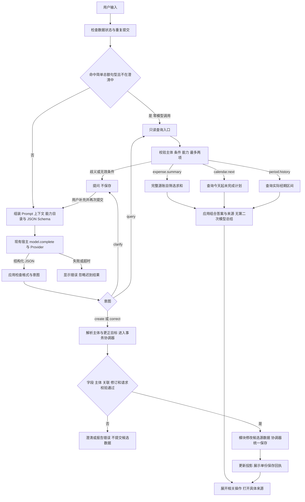
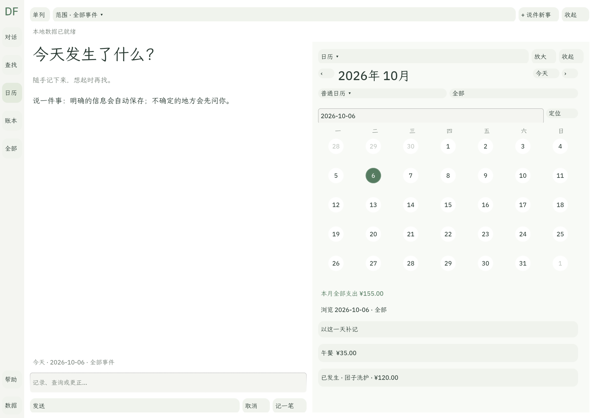
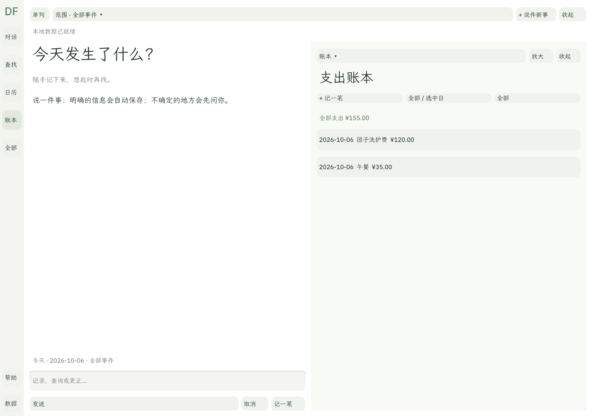
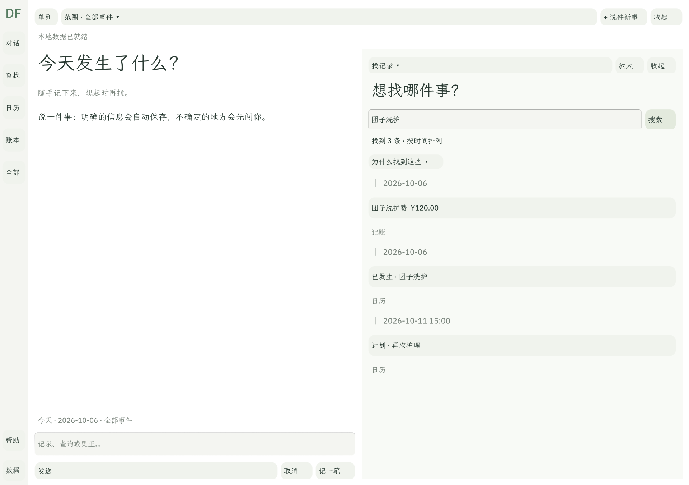

# DailyFlow 0.6.4 待审材料

状态：**仅本地准备，等待用户审核；不得提交、推送、打标签、签名、创建 App Hub Issue 或发布。** 用户将自己录制约90秒演示视频，本次不制作视频、分镜或录屏脚本。

## 请先看这几项

| 材料 | 内容 |
| --- | --- |
| 发布者 | 毛茸茸战队 |
| 公开仓库 | [KumaYuriPool/DailyFlow](https://github.com/KumaYuriPool/DailyFlow)；GitHub确认原Daliy地址指向同一仓库，当前公开、默认main |
| 应用名与版本 | DailyFlow / dailyflow / 0.6.4；定位Windows早期试用版 |
| 商店文案 | [listing.json](../bundle/listing.json)，副标题“随手记下来，想起时再找” |
| 隐私说明 | [PRIVACY.md](../PRIVACY.md)，含本机状态/备份、模型输入、其他助手授权工具及删除边界 |
| 核心架构 | 下方架构梗概与模型链路图；完整说明见 [模型执行链路与核心架构](AGENT_EXECUTION_ARCHITECTURE.md) |
| 支持渠道 | 该仓库的公开Issues；不发布私人记录 |
| 版本截图 | 下方3张真实card-host界面，均为本次新建合成记录，无个人账本 |
| 审核Issue草稿 | [APP_HUB_ISSUE_0.6.4.md](APP_HUB_ISSUE_0.6.4.md)，未发送 |

发布者ASCII ID暂拟 `kumayuripool`，与仓库账号一致；这不是已经登记的签名身份。候选标签 `v0.6.4` 尚未创建，隐私链接使用该拟定标签下的文件地址，**目前尚未上线**；应在用户审核后发布固定提交，再核验链接可访问，才可发送正式Issue。

首次提交允许unsigned，本次只制作未签名候选包，没有创建正式密钥。后续若选择签名，须在最终内容确认后重新stamp、签名并check。发布版本和签名连续性按Hub规则处理。

## 核心架构梗概

**模型提出结构化意图，应用校验并执行，专业模块持有权威数据，结果可追溯到来源。** DailyFlow的核心由三部分共同组成，不能只用Prompt或一张时间线概括。

| 部分 | 当前职责 |
| --- | --- |
| 自然语言执行 | 将当前输入、澄清问答、日期/范围、主体目录、最多12条相关摘要及能力契约交给模型；接收create/correct/query/clarify结构化意图，由应用检查并处理 |
| 源数据与时间协议 | 记账、日历事项和经期模块各自持有源记录；统一提供稳定身份、发生/计划时间、精度/区间、修订、删除信息和来源入口 |
| Flow组织与按需回顾 | 保留主体和有依据的关系；查找时组织临时时间线，用户可以打开原记录核对或更正，不复制一份业务数据或自动保存新的结果列表 |

模型不直接写业务文件，也不从少量摘要估算全部支出。查询经过能力和条件校验，再读取完整源数据计算；写入经过字段、主体、关系、修订与重复请求校验，由事务协调器保存。明确的信息按产品规则自动记录，歧义先澄清，失败不宣称保存成功。

### 模型执行链路

下图对应当前0.6.4应用内路径，依据完整架构文档整理；三条模块查询分支表示按需选择，按计划顺序执行，并非同时读取全部模块。

本图需要同时阅读的边界：

- 一次提交通常只有一次应用层model.complete调用；简单总额路径为零次。澄清后的再次提交是新请求，宿主可能内部重试，不能承诺底层HTTP只请求一次。
- 当前查询目录只有expense.summary、calendar.next、period.history，每次最多选择两项；没有模型反复调工具、自行规划直到完成的执行循环。
- 经期创建/更正仍走表单。recall与timeline_query已有独立工具/查找或时间查询能力，但尚未接入此对话查询目录；图中没有“对话自动生成任意回顾”的已实现分支。
- 这是单bundle内的伪App架构，不表示Shell Agent、独立App通信或后台自动流程已验收。Prompt帮助理解，确定性校验、完整源查询和事务保存共同保证可核对性。

完整请求组成、复合查询JSON、数据关系图及源码入口见 [AGENT_EXECUTION_ARCHITECTURE.md](AGENT_EXECUTION_ARCHITECTURE.md)。这次补充是审核说明，不是新增功能或新的模型验收。

## 商店截图

### 普通日历

合成午餐35元与团子洗护120元；同日已发生事项携带关联费用，总计155元。

### 支出账本

只计费用源，计划不计为支出。

### 按需回顾

查找“团子洗护”，显示有依据的费用、事项及后续计划；没有使用模型伪造回答。

## 这次实际改了什么

- 用真实署名和仓库渠道替换占位信息，重写当前版本的商店介绍、更新说明，加入隐私文档。
- 用当前界面替换旧截图，旧文件先保留在本地baseline；新截图来自独立合成目录。
- `dailyflow.apply`、`dailyflow.save_record` 支持删除，因此把其工具风险从act修正为destructive，并显式 `confirm: host`。这是外部工具调用的审批声明；应用内的明确记录自动保存及删除二次确认逻辑没有改动。
- 不实现对话时间线新功能，不更改容量或存储架构，不拆App。未改Shell/Rust/Provider/启动器/个人数据。

## 验证与限制

证据目录：`build/submission-review-0.6.4/`。

- `check.log`：最终候选bundle的unsigned gate通过；警告明确注明未签名和两个破坏性工具需宿主审批。
- `review.json`、`scan.log`：生成8题审核包，未运行外部reviewer，不能称人工审核通过。
- `business/report.json`：15项实际Splash工具调用通过，包括复合来源/关系、重复请求、同源更正、过期修订、失败回滚、删除保留其他来源、重启与迁移备份。此测试不证明商店宿主审批已完成端到端验收。
- `screenshots/report.json`：新建合成场景，界面检查155元总额与三条回顾、导航不写业务数据；3张截图已人工查看。
- `final-audit.json`：个人状态/Provider及原生保护哈希、测试进程清理和候选包文件哈希。
- 本轮没有新的真实模型请求。此前真实Provider验收和帮助布局验收继续见对应版本文档，不将它们冒充本轮从商店安装验收。

待审版需要如实保留的限制：模型功能依赖兼容的宿主model服务与Provider配置；本地曾使用修复后的宿主，不能据此保证所有发行版可用。Shell Agent跨App执行未验收；对话还不能直接发起完整回顾；128自动请求收据、80命名分组等容量边界未取消；无云同步/后台提醒；没有连续7天试用证据。首次提交应请求人工审核。

## 审核后才执行

用户确认材料和视频后，再决定是否采用拟定ID、版本和unsigned方式；随后检查待提交文件范围、提交并推送、创建标签、核对远端确切SHA与隐私链接、在该确切包上复验，再发送正式App Hub Issue。当前远端main是旧版本，不能拿旧SHA为这份候选包作证。商店入库仍由维护者审核决定。
